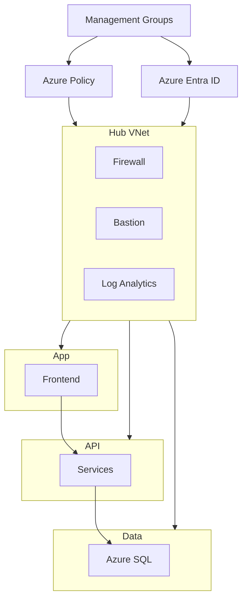

##  CST8913 – Cloud Migration - Lab 10 – Zero Trust Landing Zone

---

* **Lab:** Lab 10 – Zero Trust Landing Zone
* **Student:**   Hesheng Yang

---

##  1. Company Overview

CloudMed Solutions Inc. is a healthcare technology company that provides cloud-based telemedicine and patient management platforms across Canada, the United States, and Europe.

###  Core Product – MedConnect

* Secure telehealth sessions
* Electronic Medical Records (EMR)
* AI-based health analytics

###  Why Zero Trust?

Because CloudMed handles sensitive healthcare data, it must comply with HIPAA, GDPR, and PIPEDA regulations. To meet these requirements, the company adopts a Zero Trust architecture, which ensures that every access request is verified and secured.

###  Compliance Requirements

* HIPAA
* GDPR
* PIPEDA

---

##  2. Governance and Identity

CloudMed uses a structured governance model to control access and ensure compliance.

RBAC (Role-Based Access Control):
Admins have full control (secured with MFA), DevOps can deploy/manage resources, and Finance has read-only access for cost monitoring. This ensures users only have the permissions they need.
###  RBAC

| Role    | Permissions     |
| ------- | --------------- |
| Admin   | Full control    |
| DevOps  | Deployment      |
| Finance | Cost monitoring |

---

Azure Policies:
Policies enforce rules such as required tags, allowed regions (Canada Central, West Europe), and no public IPs. This keeps resources consistent and compliant.

###  Azure Policies

* Allowed regions only
* Mandatory tagging
* No public IPs

---

Azure Entra ID & Conditional Access:
Entra ID manages identities, while MFA and Conditional Access ensure only verified users and secure devices can access resources.

###  Management Group Hierarchy

Root
└── CloudMed
  ├── Platform
  ├── Production
  └── Development

---

###  Identity Security

* Azure Entra ID
* MFA
* Conditional Access

---

##  3. Network Architecture

CloudMed uses a Hub-and-Spoke architecture to improve security and isolation.

Hub VNet:
Contains shared services like Azure Firewall, Bastion, DNS, and Log Analytics.
Spoke VNets:
Separate networks for App, API, and Data tiers to isolate workloads.
Security Design:
Traffic between networks is controlled through the firewall, private endpoints are used instead of public access, and subnets separate different components.

This design supports Zero Trust by limiting communication and reducing attack spread.

###  Hub-and-Spoke Model

* Hub → Security services
* Spokes → Workloads

###  Hub Components

* Azure Firewall
* Azure Bastion
* DNS
* Log Analytics

###  Spokes

* App Tier
* API Tier
* Data Tier

###  Security

* Private Endpoints
* Subnet segmentation
* Controlled traffic

---

##  4. Zero Trust Controls

CloudMed applies the three Zero Trust principles:

Verify Explicitly:
Use MFA, identity authentication, and Conditional Access for every request.
###  Verify Explicitly

* MFA
* Conditional access

Least Privilege Access:
Users only get minimum permissions, and admin access is temporary (JIT).
###  Least Privilege

* Minimal RBAC
* JIT access

Assume Breach:
Networks are segmented, data is encrypted, and all activity is logged and monitored.

###  Assume Breach

* Segmentation
* Encryption
* Monitoring

Examples:

*  Bastion for secure admin access
*  Private Link for SQL
*  Policy to block public IPs
*  Firewall for traffic control
*  Defender for threat detection

---

##  5. Monitoring, Compliance, and Cost (Brief)
###  Monitoring:
Azure Monitor and Log Analytics collect logs and detect issues.
###  Compliance:
Azure Policy and Defender for Cloud ensure security rules are followed.
###  Cost Control:
Budgets, alerts, and resource tags help track and manage spending.

##  6. Architecture Diagram

---

##  7. Summary

This Zero Trust landing zone design architecture ensures:

*  Strong security through identity verification
*  Compliance with healthcare regulations
*  Scalable and modular architecture
*  Controlled access and reduced risk

---

##  8. Recommendations
###  Automation:
Use Bicep or Terraform to standardize deployments.
###  Cost Optimization:
Enable autoscaling and monitor unused resources to reduce cost.
---

##  References (APA)

Microsoft. (2023). What is an Azure landing zone?
https://learn.microsoft.com/en-us/azure/cloud-adoption-framework/ready/landing-zone/

Microsoft. (2023). Zero Trust architecture in Azure.
https://learn.microsoft.com/en-us/security/zero-trust/

Microsoft. (2023). Azure governance overview.
https://learn.microsoft.com/en-us/azure/governance/

Microsoft. (2023). Azure Monitor overview.
https://learn.microsoft.com/en-us/azure/azure-monitor/

Microsoft. (2023). Defender for Cloud overview.
https://learn.microsoft.com/en-us/azure/defender-for-cloud/

---
